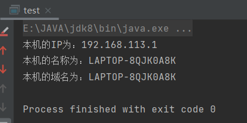
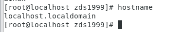
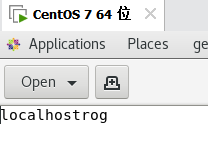
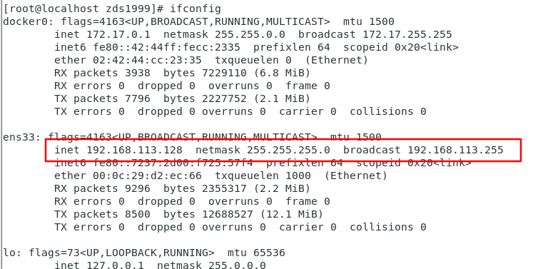
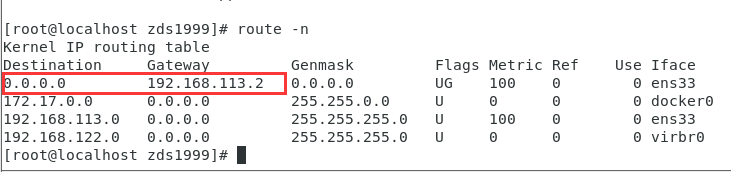
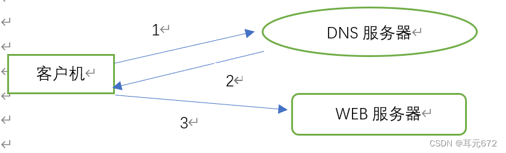
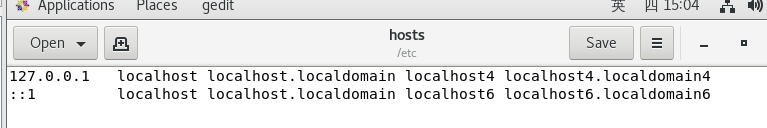
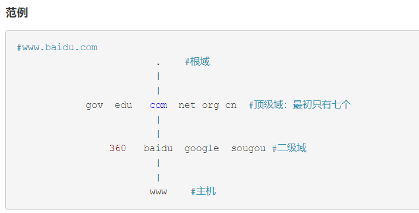
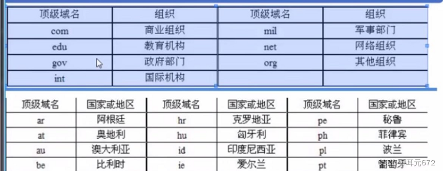
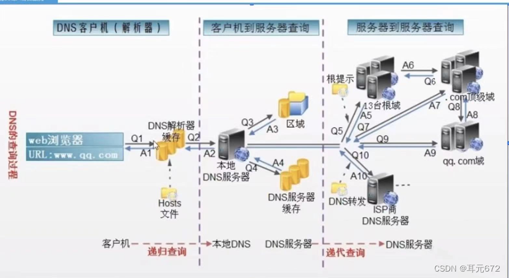

# Linux常用命令

各不同版本Linux，都是基于相同的内核版本，只是用的内核版本可能有高有低，同时各厂家自己加了自己有特点的工具，还有某些文件位置不一样，所以可以说，不同版本的Linux相同度可以达90%

**三大家族：**

linux系统基本上分两大类：

[RedHat](https://so.csdn.net/so/search?q=RedHat&spm=1001.2101.3001.7020)系列：Redhat、Centos、Fedora等；

[Debian](https://so.csdn.net/so/search?q=Debian&spm=1001.2101.3001.7020)系列：Debian、Ubuntu等；

**RedHat 系列**

常见的安装包格式 rpm包,安装rpm包的命令是“rpm -参数”

包管理工具 [yum](https://so.csdn.net/so/search?q=yum&spm=1001.2101.3001.7020)

支持tar包

**Debian系列** 

常见的安装包格式 deb包,安装deb包的命令是“dpkg -参数” 

包管理工具 apt 

支持tar包


**Linux安装软件的常识：**

**通用下载工具：**

[wget](https://so.csdn.net/so/search?q=wget&spm=1001.2101.3001.7020)是一种下载工具。可以下载网络上的资源，有点类似于迅雷。比如安装redis时需要先下载redis软件然后再安装，那就用wget命令。

**Centos：**使用yum进行软件安装；

- [yum](https://so.csdn.net/so/search?q=yum&spm=1001.2101.3001.7020)是一种安装工具。如果你想安装软件，可以使用yum安装的时候，建议使用yum安装最好，基本上是一步完成。比如安装Linux的rz/sz命令工具：直接输入：yum install -y lrzsz 就会安装了。

**Ubuntu：**使用apt进行软件安装。

- 其中还有一个apt-get，区别在于：apt = apt-get、apt-cache 和 apt-config 中最常用命令选项的集合。apt是16年对apt-get的升级整合，我们一般用apt完全够了。目前还没有任何 Linux 发行版官方放出 apt-get 将被停用的消息，至少它还有比 apt 更多、更细化的操作功能。对于低级操作，仍然需要 apt-get。

## 镜像源配置

==首先配置国内yum源。==

网易（163）yum源是国内最好的yum源之一 ，无论是速度还是软件版本，都非常的不错。

首先备份 /etc/yum.repos.d/CentOS-Base.repo

```cmd
mv /etc/yum.repos.d/CentOS-Base.repo /etc/yum.repos.d/CentOS-Base.repo.backup
```

下载对应版本 repo 文件, 放入 /etc/yum.repos.d/ 


```cmd
cd /etc/yum.repos.d

wget http://mirrors.163.com/.help/CentOS7-Base-163.repo

mv CentOS7-Base-163.repo CentOS-Base.repo
```

运行以下命令生成缓存

```
yum clean all
yum makecache
```

==国内apt源==

[ubuntu | 镜像站使用帮助 | 清华大学开源软件镜像站 | Tsinghua Open Source Mirror](https://mirror.tuna.tsinghua.edu.cn/help/ubuntu/)

## 切换管理员

具体命令：

**（1）使用 sudo 命令**

`xzm@ubuntu:~$  sudo`

然后，输入当前管理员用户密码就可以得到超级用户的权限了。但默认情况下5分钟后root权限就失效了。

**（2）可以使用 sudo -i 命令**

`xzm@ubuntu:~$  sudo -i`

接着，输入当前管理员用户的密码就可以进到root用户了。

**（3）如果想一直使用root权限，要通过su命令切换到root用户**

首先，要设置root用户的密码：

`xzm@ubuntu:~$  sudo passwd root`

这样就可以设置root用户的密码了。

然后，su，输入root密码

`xzm@ubuntu:~$  su`

之后，就可以自由的切换到root用户了

## 编辑器

主要就是两个：

1. vim
2. gedit（好用）

# 主机名、域名

**主机名和域名的联系与区别如下：**

1、Internet域名是Internet网络上的一个服务器或一个网络系统的名字,在全世界,没有重复的域名。域名的范围要比主机名大。一个域名下可以有多个主机名,域名下还可以有子域名。例如,域名cnwg.cn下,有主机server1和server2,其主机全名就是server1.cnwg.cn和server2.cnwg.cn

2、主机名的含义是机器本身的名字，域名是方面记录IP地址才做的一种IP映射；二者有共性：都能对应到一个唯一的IP上，从应用场景上可以这么简单理解二者的区别：主机名用于局域网中；域名用于公网中。

**主机名是什么**

主机名就是计算机的名字（计算机名），网上邻居就是根据主机名来识别的，这个名字可以随时更改，从我的电脑属性的计算机名就可更改。用户登陆时候用的是操作系统的个人用户帐号，这个也可以更改，从控制面板的用户界面里改就可以了。这个用户名和计算机名无关。

**域名是什么**

（英语：Domain Name），又称网域，是由一串用点分隔的名字组成的Internet上某一台计算机或计算机组的名称，用于在数据传输时对计算机的定位标识（有时也指地理位置）。

由于IP地址具有不方便记忆并且不能显示地址组织的名称和性质等缺点，人们设计出了域名，并通过[网域名](https://www.xinnet.com/tag/818)称系统（DNS，Domain Name System）来将域名和IP地址相互映射，使人更方便地访问互联网，而不用去记住能够被机器直接读取的IP地址数串。

**java查看本机的ip、主机名、域名**

```java
public static void main(String[] args) throws UnknownHostException {
    //创建本地主机的InetAddress对象
    InetAddress inetAddr = InetAddress.getLocalHost();
    //获得本地主机的IP地址
    String ip = inetAddr.getHostAddress();
    //获得本机的名称
    String HostName=inetAddr.getHostName();
    //获得本机的域名
    String canonicalHostName=inetAddr.getCanonicalHostName();
    System.out.println("本机的IP为："+ip);
    System.out.println("本机的名称为："+HostName);
    System.out.println("本机的域名为："+canonicalHostName);
    //为何域名会和主机名重名？
    //当尝试获得本地主机的域名和主机名时，如果本地主机没有域名，则显示的域名和主机名重名
}
```



```java
// cmd 运行
ipconfig
```


**Linux查看主机名、域名、IP**

```java
// 主机名
[root@localhost zds1999]# hostname

// 主机名存放在 /etc/hostname 文件里面，可以直接修改，无所谓
[root@localhost zds1999]# gedit /etc/hostname
```





```java
// 查看ip，可以看到ip地址和掩码
[root@localhost zds1999]# ifconfig
```



```java
// 查看网关
[root@localhost zds1999]# route -n
```



# 域名服务

还有同目录下的那个html博客也很详细。

## 1、前言

互联网的访问依靠IP地址，但IP地址不好记，所以使用域名服务（DNS，好记名），来替代访问的地址。



##  2、基本概念

### 2.1 hosts文件

hosts是系统文件，配置了IP地址和域名(或者主机名、主机别名)的映射关系。

最常见情况是，当访问一个网址时，系统会先在hosts文件中寻找，查看是否有需要域名和IP的映射关系，如果存在就通过IP地址寻找服务器;如果没有，则会访问DNS服务器，获得域名对应的IP地址，然后再去寻找服务器。

**不同系统的位置**

Windows：C:/Windows/System32/drivers/etc/hosts

Linux：/etc/hosts

作用：实现名字解析，主要为本地主机名，集群节点提供快速解析

数据库:平面式结构，集中式数据库

缺点：不便于查询，更新

**hosts文件如何定义映射关系?**

hosts文件的格式如下：

​			`IP地址 主机名/域名 主机别名`

一行中有三部分内容，其中主机别名不是必须的，一行中每部分之间用空格分隔。



### 2.2 DNS （Domain Name System）域名系统

作用：实现名字解析（例如将主机名解析为IP）

特点：分布式，层次性

### 2.3 FQDN

（Fully Qualified Domain Name）完全合格域名/全程域名；FQDN=主机名+域名

Eg：baidu.com 

[www.baidu.com](http://www.baidu.com/).

[www.music.baidu.com](http://www.music.baidu.com/).

[www.icbc.com.cn](http://www.icbc.com.cn/).

主机名.二级域.顶级域（根域）

```
一个域下面就包含了很多主机。
比如baidu.com这个域名下面可能就包含了www.baidu.com，mail.baidu.com等主机名。
```

```
例如：如www.baidu.com. 就是一个完全限定域名（注意最后有一个点，默认结尾点可以省略不写。最末尾的点所有名称的最上级的根）。

在查看完全限定域名时，主机名通常位于域名之前。

主机名表示用于将用户传送到某个地址或位置的网络或系统。

域名代表用户正在访问的站点或项目。

比如www.baidu.com就告诉我们，baidu.com这个域中，有一台名叫www的机器.

常见的www就是主机名，标识的对应主机，还有blog、study等都是主机名
```

```
#www
www：World Wide Web，万维网。由www客户端和www服务端组成。

	#www客户端指的是设备上的浏览器。

	#www服务端指的是服务器（存放资源的主机）。

	#www经常被简称作web,所以www客户端、www服务端又叫web客户端、web服务端

	#www的作用就是：web客户端访问web服务端

#所以www表示访问指定web服务器上面的资源，故www表示的是一台主机。

```




### 2.4 命名空间

命名空间name space：用于给互联网上的主机命名的一种机制

空间分类：



## 3、DNS相关专业术语

### 3.1DNS解析流程

3.1.1客户端查询自己的缓存（包括hosts中的记录），如果没有将查询发送/etc/resolv.conf中的DNS服务器；

3.1.2 如果本地DNS服务器对于请求的信息具有权威性，会将（权威答案）发送到客户端；

3.1.3 否则（不具有权威性），如果DNS服务器将搜索权威DNS服务器以查找信息；

a、从根区域开始，按照DNS层次结构向下搜索，直至对于信息具有权威的名称服务器，为客户端获答案DNS服务器将信息传递给客户端，并在自己的缓存中保留一个副本，以备以后查找；

b、转发到其他DNS服务器

### 3.2递归迭代



### 3.3 服务器类型

主服务器

从服务器

缓存服务器

### 3.4 正向解析/反向解析

DNS服务主要起两个作用：

（1）可以把相对的域名解析为对应的IP地址，这是正向解析；

（2）可以把对应的IP地址解析为对应的域名，这叫做反向解析，（反垃圾邮件

### 3.5 DNS域名解析示例：

（1）DNS本地缓存记录

vim /etc/hosts

192.168.142.136  [www.meneda.com](http://www.meneda.com/)

（2）主机测试ping  [www.meneda.com](http://www.meneda.com/)

（3）网站服务器辅助验证

