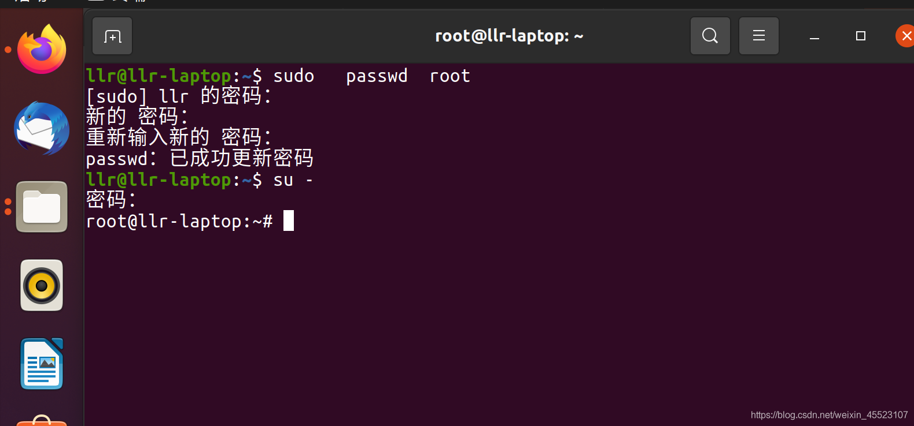
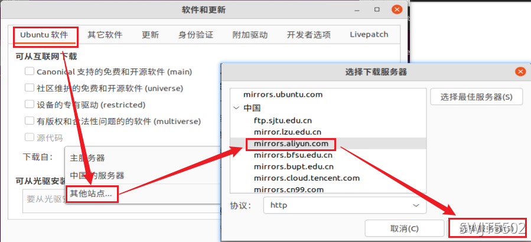
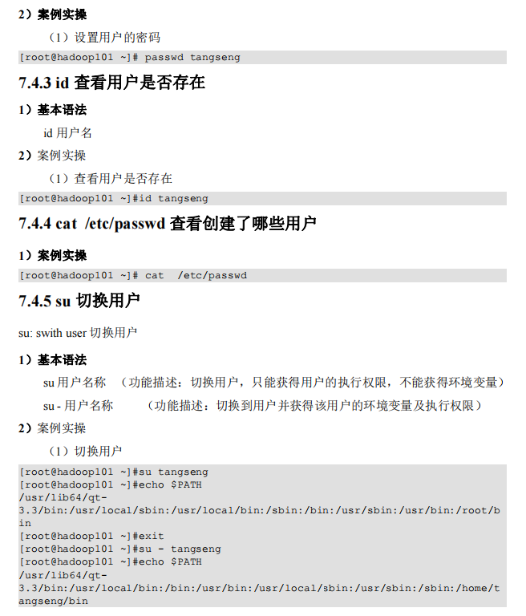

**GNU/Linux----也叫做LInux发行版本**


# Linux常识

各不同版本Linux，都是基于相同的内核版本，只是用的内核版本可能有高有低，同时各厂家自己加了自己有特点的工具，还有某些文件位置不一样，所以可以说，不同版本的Linux相同度可以达90%

**三大家族：**

linux系统主要基本上分两大类：

[RedHat](https://so.csdn.net/so/search?q=RedHat&spm=1001.2101.3001.7020)系列：Redhat、Centos、Fedora等；

[Debian](https://so.csdn.net/so/search?q=Debian&spm=1001.2101.3001.7020)系列：Debian、Ubuntu等；


**1、RedHat 系列**

常见的安装包格式 rpm包，安装rpm包的命令是“rpm -参数”

包管理工具 [yum](https://so.csdn.net/so/search?q=yum&spm=1001.2101.3001.7020)

支持tar包


**2、Debian系列** 

常见的安装包格式 deb包，安装deb包的命令是“dpkg -参数” 

包管理工具 apt 

支持tar包


**Linux安装软件的常识：**

**通用下载工具：**

[wget](https://so.csdn.net/so/search?q=wget&spm=1001.2101.3001.7020)是一种下载工具。可以下载网络上的资源，有点类似于迅雷。比如安装redis时需要先下载redis软件然后再安装，那就用wget命令。

**RedHat：Centos：**使用yum进行软件安装；

- [yum](https://so.csdn.net/so/search?q=yum&spm=1001.2101.3001.7020)是一种安装工具。如果你想安装软件，可以使用yum安装的时候，建议使用yum安装最好，基本上是一步完成。比如安装Linux的rz/sz命令工具：直接输入：yum install -y lrzsz 就会安装了。

**Debian：Ubuntu：**使用apt进行软件安装。

- 其中还有一个apt-get，区别在于：apt = apt-get、apt-cache 和 apt-config 中最常用命令选项的集合。apt是16年对apt-get的升级整合，我们一般用apt完全够了。目前还没有任何 Linux 发行版官方放出 apt-get 将被停用的消息，至少它还有比 apt 更多、更细化的操作功能。对于低级操作，仍然需要 apt-get。


## 设置root密码

Centos在安装的时候就会要你设置root用户的密码，但是Ubuntu不会这样做，是没有root密码的，需要手动设置才可以登陆root用户。





## 镜像源配置

==首先配置国内yum源。==

网易（163）yum源是国内最好的yum源之一 ，无论是速度还是软件版本，都非常的不错。

首先备份 /etc/yum.repos.d/CentOS-Base.repo

```cmd
mv /etc/yum.repos.d/CentOS-Base.repo /etc/yum.repos.d/CentOS-Base.repo.backup
```

下载对应版本 repo 文件, 放入 /etc/yum.repos.d/ 


```cmd
cd /etc/yum.repos.d

wget http://mirrors.163.com/.help/CentOS7-Base-163.repo

mv CentOS7-Base-163.repo CentOS-Base.repo
```

运行以下命令生成缓存

```
yum clean all
yum makecache
```


==国内apt源==

[ubuntu | 镜像站使用帮助 | 清华大学开源软件镜像站 | Tsinghua Open Source Mirror](https://mirror.tuna.tsinghua.edu.cn/help/ubuntu/)

```
sudo sed -i "s@http://.*archive.ubuntu.com@https://mirrors.tuna.tsinghua.edu.cn@g" /etc/apt/sources.list

sudo sed -i "s@http://.*security.ubuntu.com@https://mirrors.tuna.tsinghua.edu.cn@g" /etc/apt/sources.list
```


然后更新原

```
sudo apt-get update
sudo apt-get upgrade
```


```shell
# 1
sudo cp /etc/apt/sources.list /etc/apt/sources.list.bak
# 2
sudo gedit /etc/apt/sources.list 
```

```shell
# 3 ubuntu18
# 阿里云源
deb http://mirrors.aliyun.com/ubuntu/ focal main restricted universe multiverse
deb-src http://mirrors.aliyun.com/ubuntu/ focal main restricted universe multiverse
 
deb http://mirrors.aliyun.com/ubuntu/ focal-security main restricted universe multiverse
deb-src http://mirrors.aliyun.com/ubuntu/ focal-security main restricted universe multiverse
 
deb http://mirrors.aliyun.com/ubuntu/ focal-updates main restricted universe multiverse
deb-src http://mirrors.aliyun.com/ubuntu/ focal-updates main restricted universe multiverse
 
deb http://mirrors.aliyun.com/ubuntu/ focal-backports main restricted universe multiverse
deb-src http://mirrors.aliyun.com/ubuntu/ focal-backports main restricted universe multiverse
 
deb http://mirrors.aliyun.com/ubuntu/ focal-proposed main restricted universe multiverse
deb-src http://mirrors.aliyun.com/ubuntu/ focal-proposed main restricted universe multiverse
 
 
# 清华大学源
deb http://mirrors.tuna.tsinghua.edu.cn/ubuntu/ focal main restricted universe multiverse
deb-src http://mirrors.tuna.tsinghua.edu.cn/ubuntu/ focal main restricted universe multiverse
 
deb http://mirrors.tuna.tsinghua.edu.cn/ubuntu/ focal-security main restricted universe multiverse
deb-src http://mirrors.tuna.tsinghua.edu.cn/ubuntu/ focal-security main restricted universe multiverse
 
deb http://mirrors.tuna.tsinghua.edu.cn/ubuntu/ focal-updates main restricted universe multiverse
deb-src http://mirrors.tuna.tsinghua.edu.cn/ubuntu/ focal-updates main restricted universe multiverse
 
deb http://mirrors.tuna.tsinghua.edu.cn/ubuntu/ focal-backports main restricted universe multiverse
deb-src http://mirrors.tuna.tsinghua.edu.cn/ubuntu/ focal-backports main restricted universe multiverse
 
deb http://mirrors.tuna.tsinghua.edu.cn/ubuntu/ focal-proposed main restricted universe multiverse
deb-src http://mirrors.tuna.tsinghua.edu.cn/ubuntu/ focal-proposed main restricted universe multiverse
```

```shell
sudo apt-get update
```

```
sudo apt-get upgrade
```

```sh
# 3 ubuntu20.0
# 阿里云源
deb http://mirrors.aliyun.com/ubuntu/ focal main restricted universe multiverse
deb-src http://mirrors.aliyun.com/ubuntu/ focal main restricted universe multiverse
 
deb http://mirrors.aliyun.com/ubuntu/ focal-security main restricted universe multiverse
deb-src http://mirrors.aliyun.com/ubuntu/ focal-security main restricted universe multiverse
 
deb http://mirrors.aliyun.com/ubuntu/ focal-updates main restricted universe multiverse
deb-src http://mirrors.aliyun.com/ubuntu/ focal-updates main restricted universe multiverse
 
deb http://mirrors.aliyun.com/ubuntu/ focal-backports main restricted universe multiverse
deb-src http://mirrors.aliyun.com/ubuntu/ focal-backports main restricted universe multiverse
 
deb http://mirrors.aliyun.com/ubuntu/ focal-proposed main restricted universe multiverse
deb-src http://mirrors.aliyun.com/ubuntu/ focal-proposed main restricted universe multiverse
 
 
# 清华大学源
deb http://mirrors.tuna.tsinghua.edu.cn/ubuntu/ focal main restricted universe multiverse
deb-src http://mirrors.tuna.tsinghua.edu.cn/ubuntu/ focal main restricted universe multiverse
 
deb http://mirrors.tuna.tsinghua.edu.cn/ubuntu/ focal-security main restricted universe multiverse
deb-src http://mirrors.tuna.tsinghua.edu.cn/ubuntu/ focal-security main restricted universe multiverse
 
deb http://mirrors.tuna.tsinghua.edu.cn/ubuntu/ focal-updates main restricted universe multiverse
deb-src http://mirrors.tuna.tsinghua.edu.cn/ubuntu/ focal-updates main restricted universe multiverse
 
deb http://mirrors.tuna.tsinghua.edu.cn/ubuntu/ focal-backports main restricted universe multiverse
deb-src http://mirrors.tuna.tsinghua.edu.cn/ubuntu/ focal-backports main restricted universe multiverse
 
deb http://mirrors.tuna.tsinghua.edu.cn/ubuntu/ focal-proposed main restricted universe multiverse
deb-src http://mirrors.tuna.tsinghua.edu.cn/ubuntu/ focal-proposed main restricted universe multiverse
```


**第二种**





## 安装pip3


```
sudo apt install gsettings-desktop-schemas
```

```
sudo apt install python3-pip
```


设置pip源

```shell
# 升级pip版本
pip3 -V
pip3 install --upgrade pip

# 2、命令行修改源
pip3 config set global.index-url https://pypi.douban.com/simple/

# 查看源
pip3 config list
```


## 增加交换分区

```shell
# dd: 打开'/swapfile' 失败: 文本文件忙
sudo swapoff -a

#1. 创建分区文件, 大小 2G
dd if=/dev/zero of=/swapfile bs=1k count=2048000

#2. 生成 swap 文件系统
mkswap /swapfile

#3. 激活 swap 文件
swapon /swapfile

这样就木有问题了, 但是这样并不能在系统重启的时候自动挂载交换分区, 这样我们就需要修改 fstab.
#4. 修改 /etc/fstab 文件, 新增如下内容:
gedit /etc/fstab
/swapfile  swap  swap    defaults 0 0

这样每次重启系统的时候就会自动加载 swap 文件了.
同时，如果系统默认设置得很小，需要加上命令，使得系统积极使用交换内存
sudo sysctl vm.swappiness=100
```


```shell
# 查看分区大小
free -h
```


## 切换管理员

具体命令：

**（1）使用 sudo 命令**

`xzm@ubuntu:~$  sudo`

然后，输入当前管理员用户密码就可以得到超级用户的权限了。但默认情况下5分钟后root权限就失效了。

**（2）可以使用 sudo -i 命令**

`xzm@ubuntu:~$  sudo -i`

接着，输入当前管理员用户的密码就可以进到root用户了。

**（3）如果想一直使用root权限，要通过su命令切换到root用户**

首先，要设置root用户的密码：

`xzm@ubuntu:~$  sudo passwd root`

这样就可以设置root用户的密码了。

然后，su，输入root密码

`xzm@ubuntu:~$  su`

之后，就可以自由的切换到root用户了


## 编辑器

主要就是两个：

1. vim
2. gedit（好用）


## openJDK

 **1、使用apt下载openJDK**

```python
# 更新软件源
sudo apt update
# 查找openjdk，找到自己想要的版本
sudo apt search openjdk
# 安装openjdk #这里根据自己需要安装不同的版本(11)
sudo apt install openjdk-16-jdk
```

**2、检查java是否安装成功**

```java
java -version

>>>openjdk version "1.8.0_312"
>>>OpenJDK Runtime Environment (build 1.8.0_312-8u312-b07-0ubuntu1~20.04-b07)
>>>OpenJDK 64-Bit Server VM (build 25.312-b07, mixed mode)
```

**3、更换java版本**

```python
# 查看已经安装的java版本
sudo update-alternatives --config java

# 如果只有一个java，就会说只有一个候选项，无需配置
```

```python
# 我们再安装一个jdk11
sudo apt install openjdk-11-jdk

# 查看此时，就会发现自己变成了新安装的版本
java -version
```

```python
# 查看已经安装的java版本
sudo update-alternatives --config java
```


**4、java卸载**

如果你想卸载某个apt安装的java版本，那么使用以下指令

```py
sudo apt-get --purge remove openjdk-16-jdk
 
sudo apt-get --purge remove openjdk-16-jdk-headless
 
sudo apt-get --purge remove openjdk-16-jre
 
sudo apt-get --purge remove openjdk-16-jre-headless
```

```python
# 看我们安装了多少openJDK
apt list --installed | grep openjdk
```


## Ubuntu18无法win复制

**第一种方式：**

```cmd
sudo apt-get autoremove open-vm-tools

sudo apt-get install open-vm-tools-desktop 

# 再重启就好了
```


**第二种方式：**


# Linux学习

## 1、文件系统

==Linux 系统中一切皆文件。==


**特别注意**，有些目录是带有一个箭头的，这表示 该目录是一个链接，类似于**快捷方式**，真实的目录地址并不是在这里，例如看bin文件夹的的属性。


==主要关注点：==  mnt目录、opt目录、tmp目录、etc目录、usr目录、home目录


## **2、挂载点**

什么意思呢，很简单，其实就是，我们拿到这个Linux的系统盘之后，就像Win一样撒，先分区，不同的区放不同的东西之类的，方便管理。

例如，我们在安装Ubuntu的时候，手动将所有硬盘空间分了三个部分——一个1G、一个45G、一个4G。然后Win会给每个分区分配一个盘符，例如C盘、D盘，但是Linux不会，Linux是一切皆是文件，所有我们现在需要去访问这个磁盘空间，就需要一个**文件路径——这就是挂载点**，

也就是说我把这个**1G**的分区挂载到了 **/boot** 文件路径下，那么我在系统访问 **/boot** 目录是进入的就是这个 **1G**的磁盘分区。

其实，就是Linux需要通过文件路径（挂载点）---访问对应的真实物理内存空间。把文件路径和 真实物理磁盘空间对应起来就可以正常访问。**一个是逻辑关系，一个是真实磁盘存储关系。**


## 3、VIM/VI

VI 是 Unix 操作系统和类 Unix 操作系统中最通用的文本编辑器。

VIM 编辑器是从 VI 发展出来的一个性能更强大的文本编辑器。可以主动的以字体颜色辨别语法的正确性，方便程序设计。VIM 与 VI 编辑器完全兼容。

```
按 i 进入编辑模式
按 ESC 退出编辑模式
：wq 保存退出文件
```


## 4、网络配置

**1、查看本地Windows电脑的IP**


```
ipconfig
```

我们去Linux里面，ping这个主机ip，发现是可以通的。


**2、查看Linux系统的IP地址**


```sh
ifconfig
# 看ens33
```


**套娃的套娃**


**3、VMware提供了三种网络连接模式:**

- 桥接模式

​		虚拟机直接连接外部物理网络的模式，主机起到了网桥的作用。这种模式下，虚拟机可以直接访问外部网络，并且对外部网络是可见的。

- NAT模式

​		虚拟机和主机构建一个专用网络，并通过虚拟网络地址转换（NAT）设备对IP进行转换。虚拟机通过共享主机P可以访问外部网络，但外部网络无法访问虚拟机。

- 仅主机模式

​		虚拟机只与主机共享一个专用网络，与外部网络无法通信。


**4、修改静态IP**

第一种方式，直接界面操作。但这不是我们想要的，Linux肯定是要用命令行操作才是王道！


第二种，修改网络配置文件。(下面是centos的，Ubuntu就用第一种把)

1、修改ens33的网卡配置文件(不同发行版本，位置不一样)

```sh
vim /etc/sysconfig/network-scripts/ifcfg-ens33

vim /etc/network/interfaces
```


以下标红的项必须修改，有值的按照下面的值修改，没有该项的要增加。

```sh
TYPE="Ethernet" #网络类型（通常是 Ethemet）
PROXY_METHOD="none"
BROWSER_ONLY="no"
BOOTPROTO="static" #IP 的配置方法[none|static|bootp|dhcp]（引导
时不 使用协议|静态分配 IP|BOOTP 协议|DHCP 协议）
DEFROUTE="yes"
IPV4_FAILURE_FATAL="no"
IPV6INIT="yes"
IPV6_AUTOCONF="yes"
IPV6_DEFROUTE="yes"
IPV6_FAILURE_FATAL="no"
IPV6_ADDR_GEN_MODE="stable-privacy"
NAME="ens33"
UUID="e83804c1-3257-4584-81bb-660665ac22f6" #随机 id
DEVICE="ens33" #接口名（设备,网卡）
ONBOOT="yes" #系统启动的时候网络接口是否有效（yes/no）
#IP 地址
IPADDR=192.168.1.100
#网关
GATEWAY=192.168.1.2
#域名解析器
DNS1=192.168.1.2
```

修改后，如图 5-6 所示


**执行** **service network restart** **重启网络**


## 5、**配置主机名**

（1）查看当前服务器主机名称

`[root@hadoop100 桌面]# hostname` 

（2）如果感觉此主机名不合适，我们可以进行修改。通过编辑 `/etc/hostname` 文件

`[root@hadoop100 桌面]# vim /etc/hostname` 

修改完成后重启生效。


**修改** **hosts** **映射文件**

就是一个通讯录的样子，给ip地址起一个别名关联。

（1）打开/etc/hosts

```
[root@hadoop100 桌面]# vim /etc/hosts
```


添加如下内容

```
192.168.2.100 hadoop100
192.168.2.101 hadoop101
192.168.2.102 hadoop102
192.168.2.103 hadoop103
192.168.2.104 hadoop104
192.168.2.105 hadoop105
```


当我们在局域网内，ping hadoop100时，就会对应的找到那个ip去进行ping。

## 6、远程登陆Linux

通常在工作过程中，公司中使用的真实服务器或者是云服务器，都不允许除运维人员之外的员工直接接触，因此就需要通过远程登录的方式来操作。所以，远程登录工具就是必不可缺的，目前，比较主流的有 **Xshell**, SSH Secure Shell, SecureCRT,FinalShell 等，同学们可以根据自己的习惯自行选择.

**1、Window通过命令行ssh方式登陆**


# Shell基本命令

## 1、基础命令

```sh
pwd   #显示当前工作目录的绝对路径
pwd -P  #---会显示真正的文件路径，不考虑符号链接这些东西

ls    #列出目录下文件
ls -al  #

mkdir xiyou  # 创建一个目录
mkdir -p xiyou/dssz/meihouwang   #创建多层目录
rmdir xiyou/dssz/meihouwang     #移除目录

touch xiyou/dssz/sunwukong.txt    #创建空文件

cp xiyou/dssz/suwukong.txt xiyou/mingjie/  #复制文件
cp -r xiyou/dssz/ ./    #递归复制整个目录下内容（a——>b)

rm xiyou/mingjie/sunwukong.txt   #删除目录中的内容
rm -rf dssz/   #递归删除目录中所有内容

mv xiyou/dssz/suwukong.txt xiyou/dssz/houge.txt  #重命名
mv xiyou/dssz/houge.txt ./   # 移动文件

cat -n houge.txt    # 查看文件内容并显示行号

more smartd.conf   #采用more查看文件
less smartd.conf    #采用less查看文件

head -n 2 smartd.conf    # 查看文件的头2行
tail -n 1 smartd.conf    # 查看文件尾 1 行内容
tail -f houge.txt    #实时追踪该档的所有更新

# > 输出重定向和 >> 追加

ln    # 软连接

history    #查看已经执行过历史命令
```


、


==**这一块软连接很重要**==


**既可以链接文件，也可以链接到文件夹**

```sh
# 在软连接的路径下，用pwd查看会出现什么情况呢？？
pwd   # ---会显示软连接的目录路径
pwd -P  #---会显示真正的文件路径，不考虑符号链接这些东西

cd -P 软连接文件  # ---会直接进入到真实的目录文件路径
```


## 2、用户管理





## 3、文件权限

### 1、文件属性

Linux系统是一种典型的多用户系统，不同的用户处于不同的地位，拥有不同的权限。为了保护系统的安全性，Linux系统对不同的用户访问同一文件（包括目录文件）的权限做了不同的规定。在Linux中我们可以使用 `ll` 或者 `ls -l` 命令来显示**一个文件的属性以及文件所属的用户和组。**


详细介绍文件权限类型


如果没有权限，就会出现减号[ - ]而已。从左至右用0-9这些数字来表示:

**（1）0 首位表示类型**

在Linux中第一个字符代表这个文件是目录、文件或链接文件等等

- ​	-    代表文件
-    d    代表目录
- ​    l     链接文档(link file)；

**（2）第1-3位确定属主**（该文件的所有者）拥有该文件的权限。---User

**（3）第4-6位确定属组**（所有者的同组用户）拥有该文件的权限，---Group

**（4）第7-9位**  确定其他用户拥有该文件的权限 ---Other


**2）rwx作用文件和目录的不同解释**

（1）作用到文件：

- [ r ]代表可读(read): 可以读取，查看
- [ w ]代表可写(write): 可以修改，但是不代表可以删除该文件，删除一个文件的前提条件是对该文件所在的目录有写权限，才能删除该文件.

- [ x ]代表可执行(execute):可以被系统执行

（2）作用到目录：

- [ r ]代表可读(read): 可以读取，ls查看目录内容
- [ w ]代表可写(write): 可以修改，目录内创建+删除+重命名目录
- [ x ]代表可执行(execute):可以进入该目录


### 2、chmod改变权限

**1）基本语法**


- 指令名称 : chmod

- 使用权限 : 所有使用者

- 使用方式 : chmod [-cfvR] [–help] [–version] mode file…
  说明 : Linux/Unix 的档案调用权限分为三级 : **档案拥有者u、群组g、其他o**。利用 chmod 可以藉以控制档案如何被他人所调用

- ```yml
  chmode : 权限设定字串，格式如下 : chmod [{ugoa}{+-=}{rwx}] 文件或目录
  # u:档案拥有者 g:拥有者的同组用户 o:其他人  a:所有人(u、g、o 的总和)
  # + 表示增加权限、- 表示取消权限、= 表示唯一设定权限。
  # r 表示可读取，w 表示可写入，x 表示可执行，X 表示只有当该档案是个子目录或者该档案已经被设定过为可执行。
  -R : 对目前目录下的所有档案与子目录进行相同的权限变更(即以递回的方式逐个变更)
  ```

  ```sh
  # 例如将档案 file1.txt 设为所有人皆可读取 :
  chmod ugo+r file1.txt 
  chmod a+r file1.txt 
  # 将档案 file1.txt 与 file2.txt 设为该档案拥有者，与其所属同一个群体者可写入，但其他以外的人则不可写入 :
  chmod ug+w,o-w file1.txt file2.txt 
  # 将目前目录下的所有档案与子目录皆设为任何人可读取 
  chmod -R a+r * 
  ```

- **第二种方式更改权限，**就是用数字代替各个字母，简化书写，各个权限与数字的对应关系如下：

  ```sh
  r=4, w=2,  x=1 
  若要rwx属性则4+2+1=7；
  若要rw-属性则4+2=6；
  若要r-x属性则4+1=5。
  ```

  ```sh
  格式为:  chmod 三个组权限数字 文件或目录
  # 例如:将文件变成所有用户可读可写可执行，即文件权限对所有用户全部开放
  chmod 777 file.txt == chmod a+rwx file.txt
  ```

  


# 主机名、域名

**主机名和域名的联系与区别如下：**

1、Internet域名是Internet网络上的一个服务器或一个网络系统的名字,**在全世界,没有重复的域名。**域名的范围要比主机名大。一个域名下可以有多个主机名,域名下还可以有子域名。例如,域名cnwg.cn下,有主机server1和server2,其主机全名就是server1.cnwg.cn和server2.cnwg.cn

2、主机名的含义是机器本身的名字，域名是方面记录IP地址才做的一种IP映射；二者有共性：都能对应到一个唯一的IP上，从应用场景上可以这么简单理解二者的区别：主机名用于局域网中；域名用于公网中。

**主机名是什么**

主机名就是计算机的名字（计算机名），网上邻居就是根据主机名来识别的，这个名字可以随时更改，从我的电脑属性的计算机名就可更改。用户登陆时候用的是操作系统的个人用户帐号，这个也可以更改，从控制面板的用户界面里改就可以了。这个用户名和计算机名无关。

**域名是什么**

（英语：Domain Name），又称网域，是由一串用点分隔的名字组成的Internet上某一台计算机或计算机组的名称，用于在数据传输时对计算机的定位标识（有时也指地理位置）。

由于IP地址具有不方便记忆并且不能显示地址组织的名称和性质等缺点，人们设计出了域名，并通过[网域名](https://www.xinnet.com/tag/818)称系统（DNS，Domain Name System）来将域名和IP地址相互映射，使人更方便地访问互联网，而不用去记住能够被机器直接读取的IP地址数串。

**java查看本机的ip、主机名、域名**

```java
public static void main(String[] args) throws UnknownHostException {
    //创建本地主机的InetAddress对象
    InetAddress inetAddr = InetAddress.getLocalHost();
    //获得本地主机的IP地址
    String ip = inetAddr.getHostAddress();
    //获得本机的名称
    String HostName=inetAddr.getHostName();
    //获得本机的域名
    String canonicalHostName=inetAddr.getCanonicalHostName();
    System.out.println("本机的IP为："+ip);
    System.out.println("本机的名称为："+HostName);
    System.out.println("本机的域名为："+canonicalHostName);
    //为何域名会和主机名重名？
    //当尝试获得本地主机的域名和主机名时，如果本地主机没有域名，则显示的域名和主机名重名
}
```


```java
// cmd 运行
ipconfig
```


**Linux查看主机名、域名、IP**

```java
// 主机名
[root@localhost zds1999]# hostname

// 主机名存放在 /etc/hostname 文件里面，可以直接修改，无所谓
[root@localhost zds1999]# gedit /etc/hostname
```


```java
// 查看ip，可以看到ip地址和掩码
[root@localhost zds1999]# ifconfig
```


```java
// 查看网关
[root@localhost zds1999]# route -n
```


# 域名服务

还有同目录下的那个html博客也很详细。

## 1、前言

互联网的访问依靠IP地址，但IP地址不好记，所以使用域名服务（DNS，好记名），来替代访问的地址。


##  2、基本概念

### 2.1 hosts文件

hosts是系统文件，配置了IP地址和域名(或者主机名、主机别名)的映射关系。

最常见情况是，当访问一个网址时，系统会先在hosts文件中寻找，查看是否有需要域名和IP的映射关系，如果存在就通过IP地址寻找服务器;如果没有，则会访问DNS服务器，获得域名对应的IP地址，然后再去寻找服务器。

**不同系统的位置**

Windows：C:/Windows/System32/drivers/etc/hosts

Linux：/etc/hosts

作用：实现名字解析，主要为本地主机名，集群节点提供快速解析

数据库:平面式结构，集中式数据库

缺点：不便于查询，更新

**hosts文件如何定义映射关系?**

hosts文件的格式如下：

​			`IP地址 主机名/域名 主机别名`

一行中有三部分内容，其中主机别名不是必须的，一行中每部分之间用空格分隔。


### 2.2 DNS （Domain Name System）域名系统

作用：实现名字解析（例如将主机名解析为IP）

特点：分布式，层次性

### 2.3 FQDN

（Fully Qualified Domain Name）完全合格域名/全程域名；FQDN=主机名+域名

Eg：baidu.com 

[www.baidu.com](http://www.baidu.com/).

[www.music.baidu.com](http://www.music.baidu.com/).

[www.icbc.com.cn](http://www.icbc.com.cn/).

主机名.二级域.顶级域（根域）

```
一个域下面就包含了很多主机。
比如baidu.com这个域名下面可能就包含了www.baidu.com，mail.baidu.com等主机名。
```

```
例如：如www.baidu.com. 就是一个完全限定域名（注意最后有一个点，默认结尾点可以省略不写。最末尾的点所有名称的最上级的根）。

在查看完全限定域名时，主机名通常位于域名之前。

主机名表示用于将用户传送到某个地址或位置的网络或系统。

域名代表用户正在访问的站点或项目。

比如www.baidu.com就告诉我们，baidu.com这个域中，有一台名叫www的机器.

常见的www就是主机名，标识的对应主机，还有blog、study等都是主机名
```

```
#www
www：World Wide Web，万维网。由www客户端和www服务端组成。

	#www客户端指的是设备上的浏览器。

	#www服务端指的是服务器（存放资源的主机）。

	#www经常被简称作web,所以www客户端、www服务端又叫web客户端、web服务端

	#www的作用就是：web客户端访问web服务端

#所以www表示访问指定web服务器上面的资源，故www表示的是一台主机。

```


### 2.4 命名空间

命名空间name space：用于给互联网上的主机命名的一种机制

空间分类：


## 3、DNS相关专业术语

### 3.1DNS解析流程

3.1.1客户端查询自己的缓存（包括hosts中的记录），如果没有将查询发送/etc/resolv.conf中的DNS服务器；

3.1.2 如果本地DNS服务器对于请求的信息具有权威性，会将（权威答案）发送到客户端；

3.1.3 否则（不具有权威性），如果DNS服务器将搜索权威DNS服务器以查找信息；

a、从根区域开始，按照DNS层次结构向下搜索，直至对于信息具有权威的名称服务器，为客户端获答案DNS服务器将信息传递给客户端，并在自己的缓存中保留一个副本，以备以后查找；

b、转发到其他DNS服务器

### 3.2递归迭代


### 3.3 服务器类型

主服务器

从服务器

缓存服务器

### 3.4 正向解析/反向解析

DNS服务主要起两个作用：

（1）可以把相对的域名解析为对应的IP地址，这是正向解析；

（2）可以把对应的IP地址解析为对应的域名，这叫做反向解析，（反垃圾邮件

### 3.5 DNS域名解析示例：

（1）DNS本地缓存记录

vim /etc/hosts

192.168.142.136  [www.meneda.com](http://www.meneda.com/)

（2）主机测试ping  [www.meneda.com](http://www.meneda.com/)

（3）网站服务器辅助验证


# mysql


# Linux 守护启动java

**启动java程序**

（1）直接启动，控制台退出则关掉应用

    java -jar uap-register-server-1.0.0.jar

（2）后台启动，控制台退出不会关掉应用

    nohup  java -jar uap-register-server-1.0.0.jar &

（3）后台启动并且输出日志，控制台退出不会关掉应用

    nohup  java -jar uap-register-server-1.0.0.jar >> ./register.log 2>&1 &

（3）后台启动(加内存)并且输出日志，控制台退出不会关掉应用

    nohup java -jar -Xms1024m -Xmx2048m uap-register-server-1.0.0.jar>> ./register.log 2>&1 &


**关闭程序**

 （1）查询java应用程序

    ps -ef|grep java

 （2）强制杀掉进程

    kill -9 xxx
